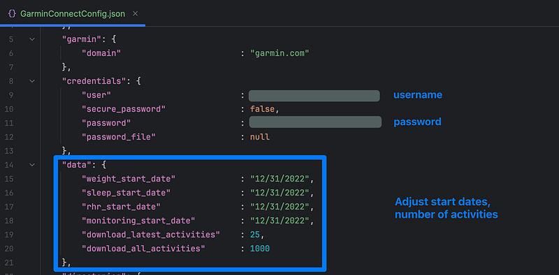

# garmin-analysis

My personal project to analyze activities from Garmin device. The current goal focuses on Fitness Activities.

Proportions of this project utilize the library [GarminDb](https://github.com/tcgoetz/GarminDB), developed
by [@tcgoetz](https://github.com/tcgoetz).

## How to use

### Install dependencies

Install required dependencies by running the following command.
```pip install -r requirements.txt```

### Configure GarminDb

Download
the [GarminConnectConfig.json.example](https://raw.githubusercontent.com/tcgoetz/GarminDB/master/garmindb/GarminConnectConfig.json.example)
to ~/.GarminDb/GarminConnectConfig.json.

Edit relevant fields as following.


Download all the data and create SQLite DB.
```garmindb_cli.py --all --download --import --analyze```

Use notebooks in folder [./notebooks](https://github.com/thibault2705/garmin-analysis/tree/main/notebooks)

## Generated charts
An example output from ```Fitness.plot_relationship_bubble_chart()```

